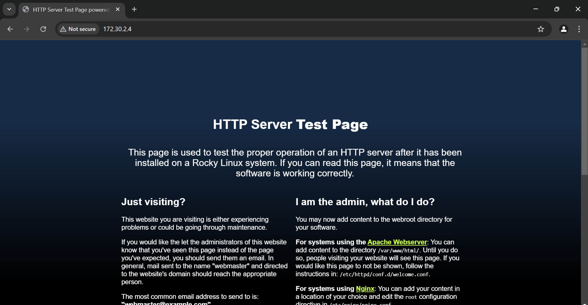
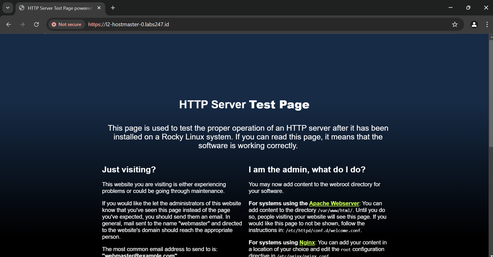

# How to Install Nginx

## Introduction
Nginx is a highly popular web server used for deploying web servers, reverse proxies, load balancers, and more. In this guide, we’ll walk through the process of installing Nginx specifically on a Rocky Linux-based operating system, configuring the firewall, and setting up self-signed certificates to enable HTTPS for our web server.

## Prerequisites
Before deploying Nginx, ensure you have a regular user account with `sudo` privileges.

## Step 1 - Installing Nginx
Nginx is available by default in Rocky Linux repositories. You can install it using the `dnf` package manager with the following command:

```
sudo dnf install nginx
```

When prompted, review the installation details and press `y` to proceed. Once the installation is complete, enable and start the Nginx service with this command:

```
sudo systemctl enable --now nginx
```

This ensures Nginx starts automatically on boot and is running immediately.

## Step 2 - Configuring the Firewall and SELinux
If `firewalld` and SELinux are enabled (which is the default on Rocky Linux), you won’t be able to access Nginx’s default homepage on port 80 without additional configuration. You’ll need to allow HTTP traffic through the firewall and permit network connections for HTTP in SELinux.

Run the following commands to allow the HTTP service in `firewalld` and reload the configuration:

```
sudo firewall-cmd --add-service=http --permanent && sudo firewall-cmd --reload
```

To verify the rule has been applied, check the firewall settings:

```
sudo firewall-cmd --list-all
```

You should see output similar to this:

```
public (active)
  target: default
  icmp-block-inversion: no
  interfaces: eth0
  sources:
  services: cockpit dhcpv6-client http ssh
  ports:
  protocols:
  forward: yes
  masquerade: no
  forward-ports:
  source-ports:
  icmp-blocks:
  rich rules:
```

Next, allow HTTP network access in SELinux:

```
sudo setsebool -P httpd_can_network_connect true
```

## Step 3 - Verifying the Nginx Service
Your web server should now be running. To confirm, check the status of the Nginx service:

```
sudo systemctl status nginx
```

If it’s running correctly, you’ll see output like this:

```
● nginx.service - The nginx HTTP and reverse proxy server
     Loaded: loaded (/usr/lib/systemd/system/nginx.service; enabled; preset: disabled)
     Active: active (running) since Wed 2025-03-19 01:56:22 UTC; 31s ago
    Process: 362284 ExecStartPre=/usr/bin/rm -f /run/nginx.pid (code=exited, status=0/SUCCESS)
    Process: 362285 ExecStartPre=/usr/sbin/nginx -t (code=exited, status=0/SUCCESS)
    Process: 362286 ExecStart=/usr/sbin/nginx (code=exited, status=0/SUCCESS)
   Main PID: 362287 (nginx)
      Tasks: 2 (limit: 10892)
     Memory: 2.0M
        CPU: 36ms
     CGroup: /system.slice/nginx.service
             ├─362287 "nginx: master process /usr/sbin/nginx"
             └─362288 "nginx: worker process"

Mar 19 01:56:22 homelab.immanuelbint.com systemd[1]: Starting The nginx HTTP and reverse proxy server...
Mar 19 01:56:22 homelab.immanuelbint.com nginx[362285]: nginx: the configuration file /etc/nginx/nginx.conf syntax is ok
Mar 19 01:56:22 homelab.immanuelbint.com nginx[362285]: nginx: configuration file /etc/nginx/nginx.conf test is successful
Mar 19 01:56:22 homelab.immanuelbint.com systemd[1]: Started The nginx HTTP and reverse proxy server.
```

You can now access the default Nginx homepage by entering your server’s IP address in a browser, like this: `http://<ip-address>:80` (replace `<ip-address>` with your server’s actual IP).



## Step 4 - Managing Nginx
With your web server running, here are some essential commands to manage the Nginx service:

- **Stop the Nginx service:**
  ```
  sudo systemctl stop nginx
  ```

- **Start the Nginx service:**
  ```
  sudo systemctl start nginx
  ```

- **Restart the Nginx service:**
  ```
  sudo systemctl restart nginx
  ```

Earlier, we enabled Nginx to start on boot. To disable this behavior, use:

```
sudo systemctl disable nginx
```

Now, let’s explore key Nginx directories:

### Main Configuration Folders
- `/etc/nginx`: The primary Nginx configuration directory.
- `/etc/nginx/nginx.conf`: The default configuration file for the homepage served on port 80.
- `/etc/nginx/conf.d`: A directory for additional server block configurations, such as hosted websites or reverse proxy settings.

### Nginx Logs
- `/var/log/nginx/access.log`: Stores logs of all requests to the web server.
- `/var/log/nginx/error.log`: Records all Nginx-related errors.

## Step 5 - Setting Up TLS/SSL
To enhance security, we’ll upgrade our HTTP connection to HTTPS. Since we’re not using a public domain or paid certificate, we’ll create a self-signed certificate for learning purposes.

First, create a directory to store certificates and keys:

```
sudo mkdir -p /data/self-managed-ca/{certs,keys}
cd /data/self-managed-ca
```

### Create a Certificate Authority (CA)
Generate a CA configuration file (you can name it as desired):

```
tee -a ca.cnf <<EOF
# OpenSSL CA configuration file
[ ca ]
default_ca = CA_default

[ CA_default ]
default_days = 365
database = index.txt
serial = serial.txt
default_md = sha256
copy_extensions = copy
unique_subject = no

[ req ]
prompt=no
distinguished_name = distinguished_name
x509_extensions = extensions

[ distinguished_name ]
organizationName = Hostmaster
commonName = Hostmaster CA

[ extensions ]
keyUsage = critical,digitalSignature,nonRepudiation,keyEncipherment,keyCertSign
basicConstraints = critical,CA:true,pathlen:1

[ signing_policy ]
organizationName = supplied
commonName = optional

[ signing_node_req ]
keyUsage = critical,digitalSignature,keyEncipherment
extendedKeyUsage = serverAuth,clientAuth

[ signing_client_req ]
keyUsage = critical,digitalSignature,keyEncipherment
extendedKeyUsage = clientAuth
EOF
```

Generate the CA key and set restrictive permissions:

```
sudo openssl genrsa -out keys/ca.key 4096
sudo chmod 400 keys/ca.key
```

Create the CA certificate:

```
openssl req \
  -new -x509 \
  -config ca.cnf \
  -key keys/ca.key \
  -out certs/ca.crt \
  -days 365 \
  -batch
```

### Create a Client Certificate
To simplify configuration, use variables for the hostname and IP address:

```
ip=$(hostname -I | awk '{print $1}')
hostname=$(hostname -f)
```

Verify the variables:

```
echo $ip    # Example output: 172.30.2.4
echo $hostname    # Example output: homelab.immanuelbint.com
```

Reset the CA database:

```
rm -f index.txt serial.txt
touch index.txt
echo '01' > serial.txt
```

Create a node configuration file:

```
tee -a node.cnf <<EOF
[ req ]
prompt=no
distinguished_name = distinguished_name
req_extensions = extensions

[ distinguished_name ]
organizationName = Hostmaster

[ extensions ]
subjectAltName = critical,DNS:"$hostname",DNS:"$hostname",IP:"$ip"
EOF
```

Generate the client key:

```
openssl genrsa -out certs/"$hostname".key 4096
chmod 400 certs/"$hostname".key
```

Create a Certificate Signing Request (CSR):

```
openssl req \
  -new \
  -config node.cnf \
  -key certs/"$hostname".key \
  -out "$hostname".csr \
  -batch
```

Sign the CSR with the CA:

```
openssl ca \
  -config ca.cnf \
  -keyfile keys/ca.key \
  -cert certs/ca.crt \
  -policy signing_policy \
  -extensions signing_node_req \
  -in "$hostname".csr \
  -out certs/"$hostname".crt \
  -outdir certs/ \
  -batch
```

If successful, you’ll see output like this:

```
Using configuration from ca.cnf
Check that the request matches the signature
Signature ok
The Subject's Distinguished Name is as follows
organizationName      :ASN.1 12:'Hostmaster'
Certificate is to be certified until Mar 19 02:43:58 2026 GMT (365 days)
Write out database with 1 new entries
Database updated
```

Verify the certificate:

```
openssl x509 -in certs/"$hostname".crt -text | grep "X509v3 Subject Alternative Name" -A 1
```

Expected output:

```
            X509v3 Subject Alternative Name: critical
                DNS:homelab.immanuelbint.com, DNS:homelab.immanuelbint.com, IP Address:172.30.2.4
```

### Update Nginx Configuration
Modify the Nginx configuration to use the SSL certificate. Replace the paths below with your actual certificate locations (e.g., `/data/self-managed-ca`):

```
sudo tee /etc/nginx/nginx.conf <<EOF
user nginx;
worker_processes auto;
error_log /var/log/nginx/error.log;
pid /run/nginx.pid;

include /usr/share/nginx/modules/*.conf;

events {
    worker_connections 1024;
}

http {
    log_format main '\$remote_addr - \$remote_user [\$time_local] "\$request" '
                     '\$status \$body_bytes_sent "\$http_referer" '
                     '"\$http_user_agent" "\$http_x_forwarded_for"';

    access_log /var/log/nginx/access.log main;

    sendfile            on;
    tcp_nopush          on;
    tcp_nodelay         on;
    keepalive_timeout   65;
    types_hash_max_size 4096;

    include             /etc/nginx/mime.types;
    default_type        application/octet-stream;

    include /etc/nginx/conf.d/*.conf;

    server {
        listen       80 default_server;
        listen       [::]:80 default_server;
        server_name  "$ip";
        return 301 https://\$host\$request_uri; # Redirect to HTTPS
        root         /usr/share/nginx/html;

        include /etc/nginx/default.d/*.conf;

        location / {
        }

        error_page 404 /404.html;
            location = /404.html {
        }

        error_page 500 502 503 504 /50x.html;
            location = /50x.html {
        }
    }

    server {
        listen       443 ssl http2;
        listen       [::]:443 ssl http2;
        server_name  "$ip";
        root         /usr/share/nginx/html;

        ssl_certificate "/data/self-managed-ca/certs/$hostname.crt";
        ssl_certificate_key "/data/self-managed-ca/certs/$hostname.key";
        ssl_session_cache shared:SSL:1m;
        ssl_session_timeout  10m;
        ssl_ciphers HIGH:!aNULL:!MD5;
        ssl_prefer_server_ciphers on;
        ssl_protocols TLSv1.2;

        include /etc/nginx/default.d/*.conf;

        location / {
        }

        error_page 404 /404.html;
            location = /404.html {
        }

        error_page 500 502 503 504 /50x.html;
            location = /50x.html {
        }
    }
}
EOF
```

Test the configuration:

```
sudo nginx -t
```

If successful, you’ll see:

```
nginx: the configuration file /etc/nginx/nginx.conf syntax is ok
nginx: configuration file /etc/nginx/nginx.conf test is successful
```

Restart Nginx to apply the changes:

```
sudo systemctl restart nginx
```

### Allow HTTPS in the Firewall
Before testing, allow HTTPS traffic through the firewall:

```
sudo firewall-cmd --add-service=https --permanent && sudo firewall-cmd --reload
```

Now, access your server at `https://<hostname>:443` (replace `<hostname>` with your actual hostname). You may see a "not secure" warning due to the self-signed certificate. To bypass this temporarily, import the CA certificate (`certs/ca.crt`) into your browser.




## 📎 Related Scripts
* 🚧 Content under construction